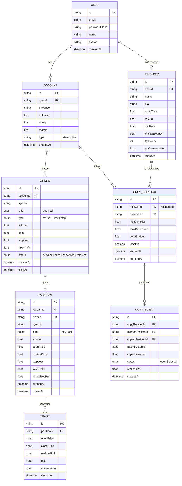

# Entity-Relationship Diagram — Core Trading Models

## API Endpoint Summary

| Method | Endpoint                      | Description              |
| ------ | ----------------------------- | ------------------------ |
| POST   | `/auth/login`                 | Login, get tokens        |
| POST   | `/auth/refresh`               | Refresh access token     |
| GET    | `/accounts/:id`               | Account snapshot         |
| GET    | `/market/ohlc`                | Historical OHLC bars     |
| GET    | `/market/watchlist`           | User watchlist + quotes  |
| POST   | `/orders`                     | Place market/limit/stop  |
| GET    | `/orders`                     | Order history            |
| DELETE | `/orders/:id`                 | Cancel pending order     |
| GET    | `/accounts/:id/positions`     | Current open positions   |
| DELETE | `/accounts/:id/positions/:id` | Close position at market |
| GET    | `/providers`                  | Provider leaderboard     |
| GET    | `/providers/:id`              | Provider detail          |
| POST   | `/copy/:providerId/follow`    | Start copying            |
| DELETE | `/copy/:providerId/unfollow`  | Stop copying             |
